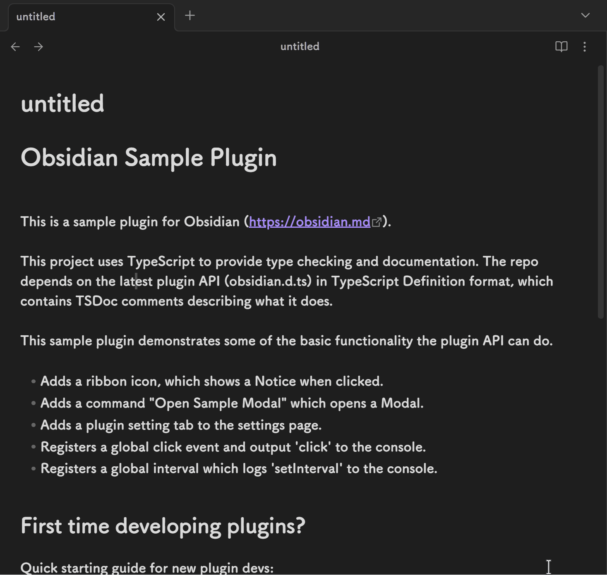

# 平滑光标

## 介绍

平滑光标是一个 Obsidian 插件，它可以让你的光标平滑地移动，而不是突然跳跃到目标位置。

该插件支持光标拖尾，在光标移动的时候显示移动的轨迹。

你可以设置是否开启拖尾。

## 自定义设置

> 你可以通过设置面板进行自定义，也可以通过修改 'styles.css' 文件进行自定义。css 文件修改需要重启 obsidian 才能生效。

* 光标颜色（设置面板和 css 文件会自动同步）
* 光标闪烁速度（设置面板和 css 文件会自动同步）
* 开关拖尾
* 拖尾颜色
* 拖尾速度

## 演示

## 已知的问题

* dom 元素的增减变化（即此类变化， '**a**' 变为 'a' 或反过来）会导致拖尾刷新，因为 Selection 在该情况下不会自动更新，所以插件进行了光标的左右移动以触发刷新。
* 光标从表格文件切换到普通文件的时候可能会定位到编辑区最上层，光标动画可能看起来会有点奇怪。

# Smooth Cursor

## Introduction

Smooth Cursor is an Obsidian plugin that makes your cursor move smoothly instead of jumping abruptly to the target position.

This plugin supports cursor trails, displaying a motion trail as the cursor moves.

You can enable or disable the trail effect as needed.

## Customizable Settings

> You can customize it through the settings panel, or by modifying the 'styles.css' file.Css file modifications require a restart of Obsidian.

* Cursor color (the settings panel and the CSS file will automatically sync)
* Cursor blink speed (the settings panel and the CSS file will automatically sync)
* Toggle trail effect
* Trail color
* Trail speed

## Demo

## Known Issues

* DOM element changes (such as '**a**' becoming 'a' or vice versa) will cause the trail to refresh, because the Selection object will not update automatically when the cursor moves. So, the plugin moves the cursor left and right to trigger a refresh.
* When the cursor switches from a table file to a regular file, it may locate the cursor at the top of the editing area, which may look odd for the cursor animation.